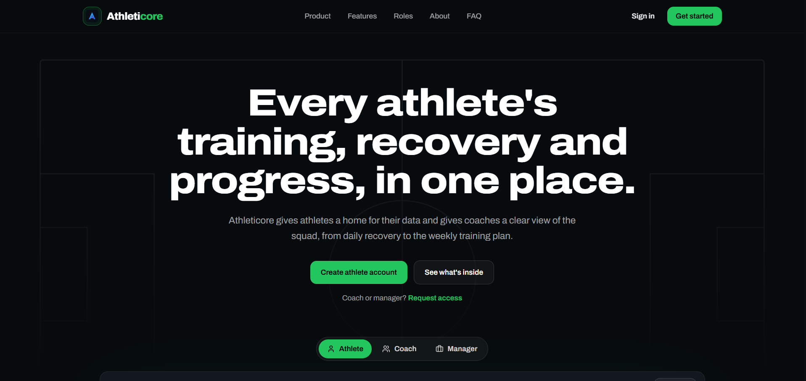
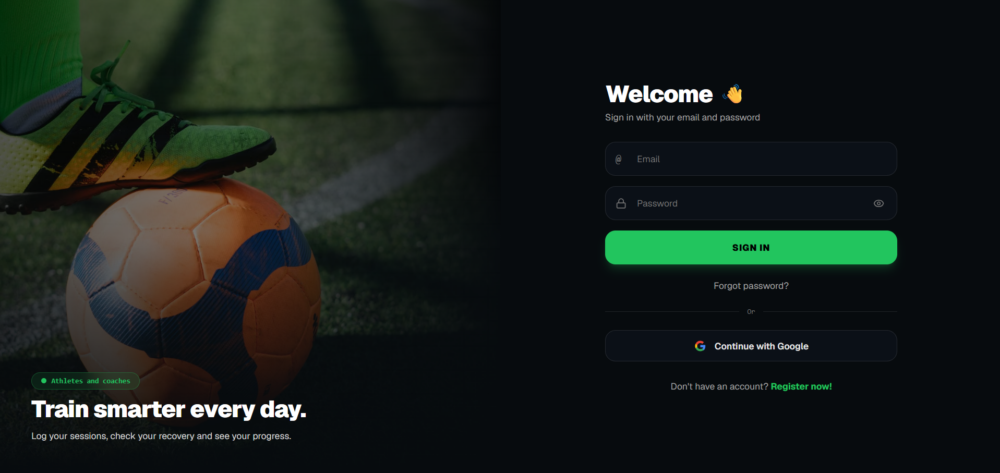
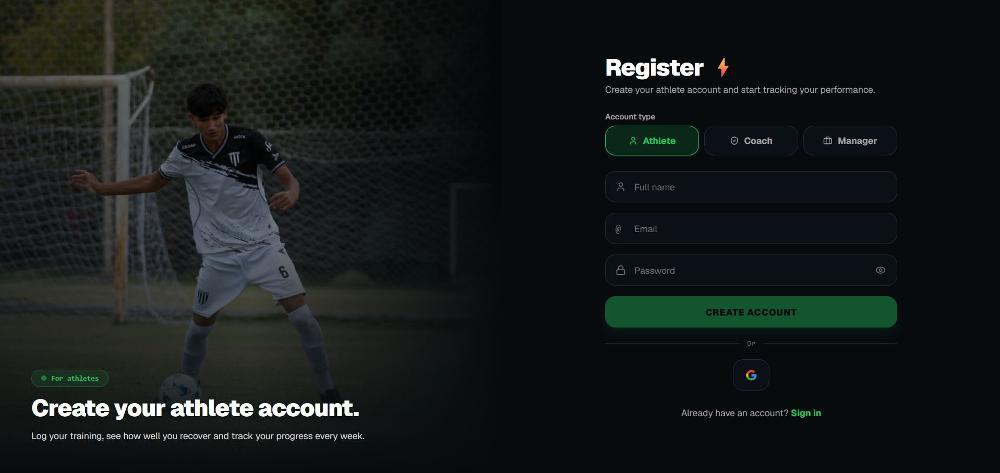
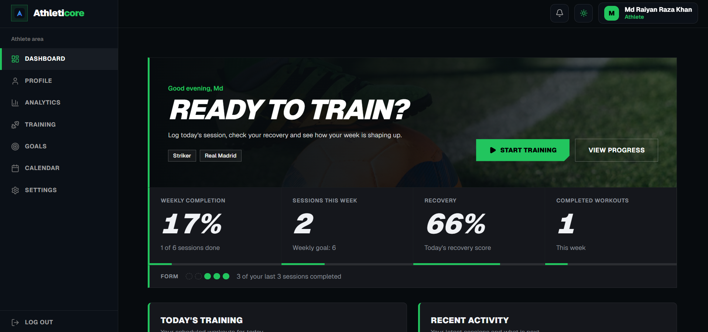
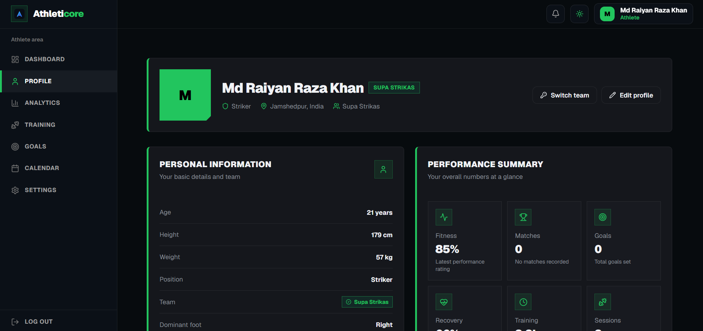
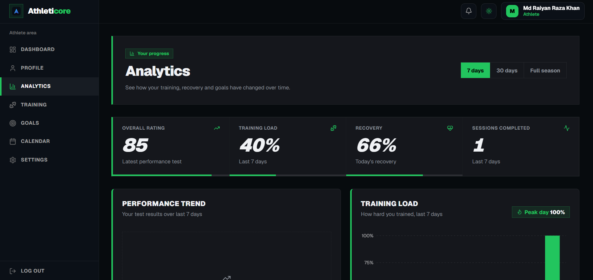
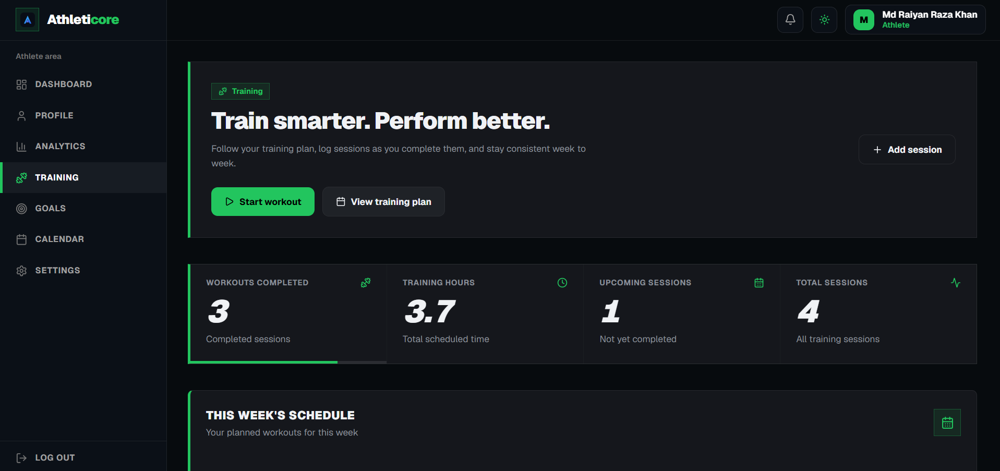
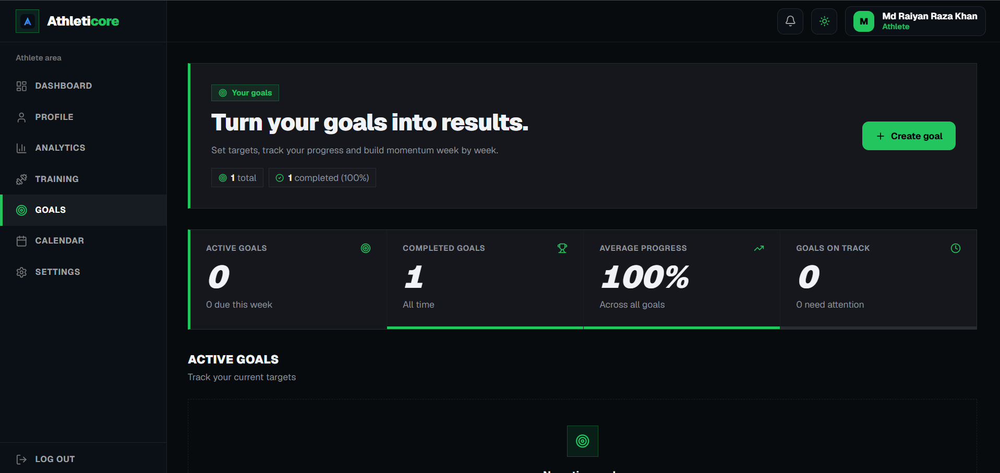

# ⚽ AthletiCore

### Athlete Development & Management Platform

Building a connected ecosystem for athletes, coaches, and football academies.

[View Product Screenshots](#product-screenshots) · [Explore Features](#core-features)

---

## About the Project

AthletiCore aims to simplify how football academies manage athletes and how players track their development.

Instead of relying on disconnected spreadsheets, messages, and manual records, the platform brings essential athlete-development workflows into one place.

## Core Features

* **Athlete Profiles** — Player identity and development records.
* **Coach Dashboard** — Manage athletes and coaching workflows.
* **Training Management** — Organize and track training activities.
* **Performance Analytics** — Visualize player progress.
* **Goals & Development Plans** — Track individual improvement objectives.
* **Team Management** — Organize athletes and teams.
* **Calendar** — Manage training schedules and activities.

## Technology Stack

| Layer          | Technology                          |
| -------------- | ----------------------------------- |
| Frontend       | React, TypeScript, Vite             |
| Styling        | Tailwind CSS                        |
| Authentication | Firebase Authentication             |
| Database       | Cloud Firestore                     |
| Security       | Firebase App Check, Firestore Rules |
| Charts         | Recharts                            |
| Animation      | Framer Motion                       |
| Icons          | Lucide React                        |

## Product Screenshots

## Product Screenshots

### Landing Page

### Login Page

### Registration Page

### Athlete Dashboard

### Athlete Profile

### Athlete Analytics

### Athlete Training

### Athlete Goals

## Product Roadmap

* [x] Athlete dashboard foundation
* [x] Authentication and role-based workflows
* [x] Core athlete and coach interfaces
* [ ] Pilot-ready academy workflows
* [ ] Advanced performance insights
* [ ] AI-assisted development reports
* [ ] Athlete verification and recruitment
* [ ] Multi-sport expansion

## Project Status

🚧 **Under active development**

AthletiCore is being developed as a commercial product. This public repository serves as a product showcase; the application source code is maintained privately.

## Founder & Developer

**Md Raiyan Raza Khan**

Founder and Developer — AthletiCore

## Connect

* GitHub: [RaiyanCoder7](https://github.com/RaiyanCoder7)

---

*AthletiCore — Helping athletes track progress and coaches support development.*

## Intellectual Property

AthletiCore is an independently developed commercial product.

The AthletiCore name, branding, original product materials, and original content in this showcase are © 2026 Md Raiyan Raza Khan, unless otherwise stated.

The application source code is maintained in a separate private repository and is not licensed for public reuse through this showcase.

This notice does not change the terms of any previously released MIT-licensed code or third-party materials.
